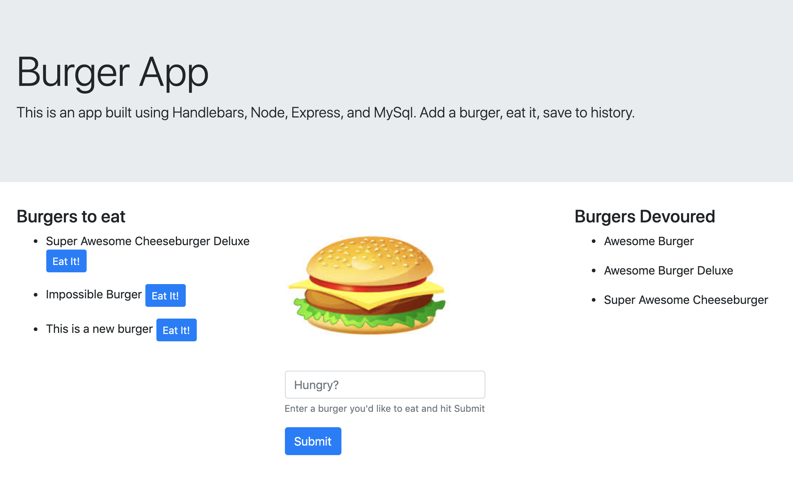

# Burger app

## What Is This Thing

Burger app is a full stack application for burger lovers to track types of burgers you've eaten.  You enter a burger by name, then can 'eat it', and save to a database for tracking.

## Application Details

The application uses HTML + Bootstrap + Handlebars with jQuery for it's front-end, Node.js and Express for the back-end, MySQL for storage, and is hosted on Heroku.

Visit the hosted application here: https://cryptic-headland-75466.herokuapp.com/

## Technologies

- Node.js
- Express
- jQuery
- HTML/Bootstrap/Handlebars
- MySQL

